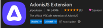
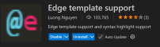
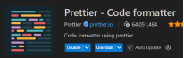

# Resume Adonis

> AdonisJS est un framework **backend** "tout-en-un" pour Node.js, orienté TypeScript, conçu pour développer rapidement des applications **web** et des API robustes
> Basé sur le schéma MVC (Model View Controller), il s'agit d'un des framework les plus utilisé en developpement web

## Guide d'installation

```bash
npm init adonisjs@latest app-teachers-adonisjs -- --kit=web --db=mysql --authguard=session
```

> `app-teachers-adonisjs` est le nom du projet.
> <br>`--kit=web` permet de spécifier que nous souhaitons créer une application web de rendu serveur traditionnelle.
> <br>`--db=mysql` permet de spécifier le SGBDR souhaité, dans notre cas MySQL.
> <br>`--auth-guard=session` permet de spécifier le garde d'authentification, à savoir session, qui est basé sur les sessions et les cookies

### Exensions VSCode





## Définition d'une vue

> Tout simplement, une vue est un fichier contenant une combinaison d'HTML et de balises dynamiques, servant à insérer des données générées par le serveur

### Exemple de vue (système d'alerte)

```html
@if(flashMessages.has('success'))
<div class="alert alert-success">{{ old('success') }}</div>
@end @if(flashMessages.has('error'))
<div class="alert alert-danger">{{ old('error') }}</div>
@end
```
